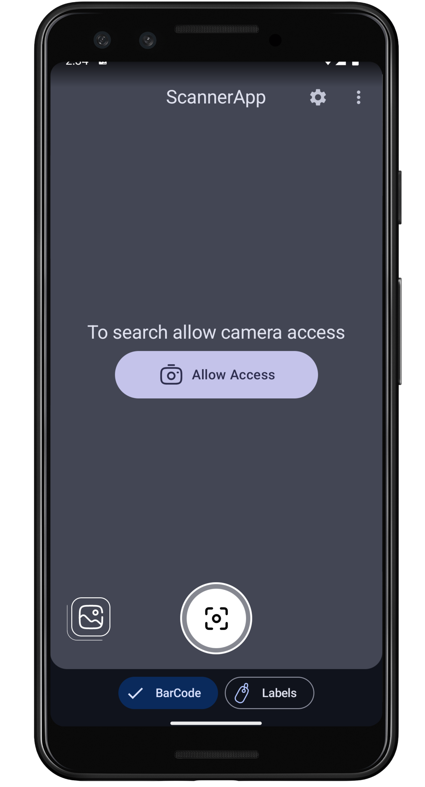
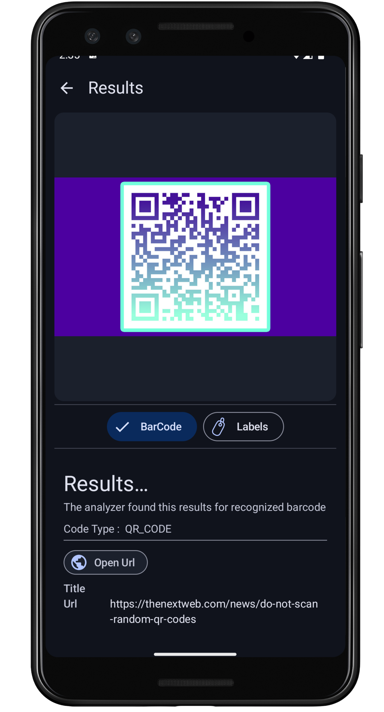
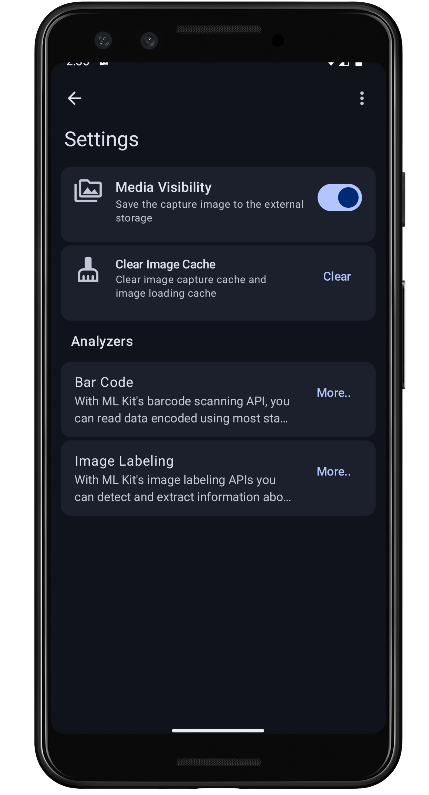
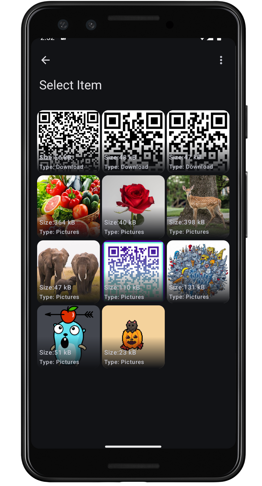
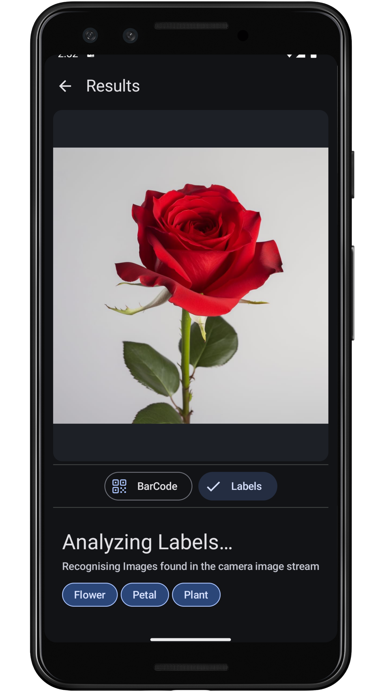
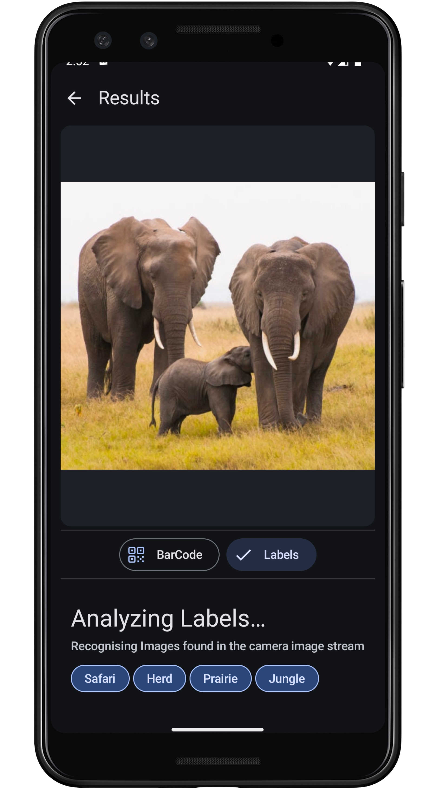
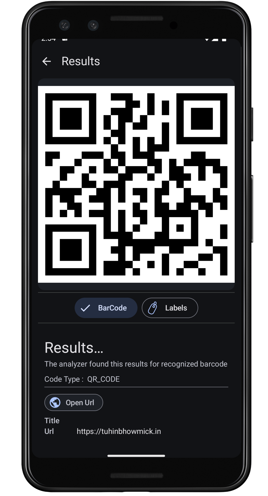

# 📸 ScannerAndroid App

## 💁 About

**ScannerAndroid App** is a scanner-based app that can scan barcode, qr-codes and image labels. It
takes help from Google's ML Kit barcode scanner and image labeling api to recognize barcodes and
labels within
images or camera stream.

## 🏗️ Features

As the about speaks its scanner app, most of the common features of scanner-based apps are included
in the app

- **Realtime Identification**: As scanner apps, it can recognize barcodes or labels over camera
  stream without saving the camera results
- **BarCode Types**: Barcodes are recognized over types and have a specialized UI to convey the
  information over to the user at ease
- **Device Gallery**: The app also has its own device gallery from where the user can check its
  local images taken previously

## Screenshots

These are some of the screen shots for the app for more screen shots check [here](./screenshots)

  
  
  
  
  
  
  

## 🎁 Contributing

If you would like to contribute to [Image Scanner App](https://github.com/tuuhin/ScannerAndroidApp),
follow
these steps:

1. Fork the repository on GitHub.
2. Create a new branch with your changes.
3. Commit your changes and push your branch to your fork.
4. Submit a pull request to the main repository.

## 🔚 Conclusion

The project was started as a Google Lens clone. However, I did struggle a bit with the Ui. However,
the
end product has most of the feature common to the actual apps and yes, it's on device ml, so it is
not
always able to recognize certain barcode or labels.
